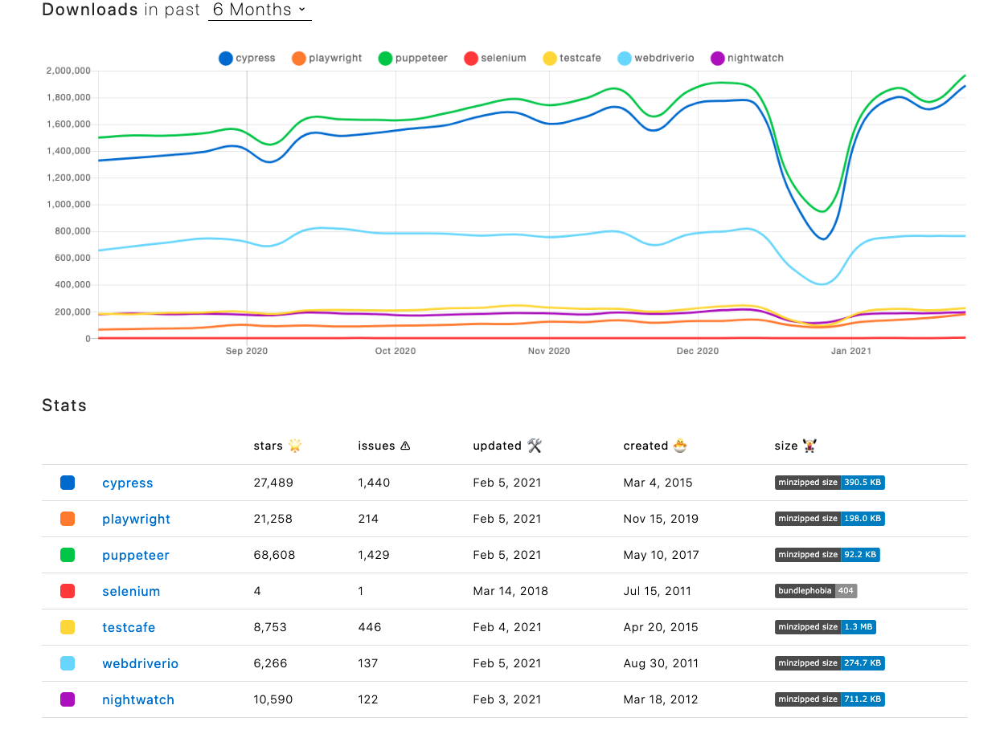
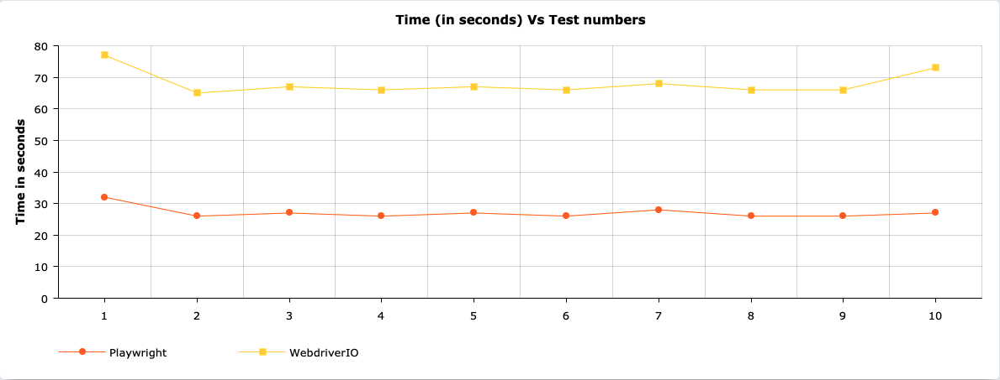

# Evaluation of Microsoft Playwright

## Table of Contents

- [Introduction](#Introduction)

- [Project Background](#project-background)

- [WebdriverIO](#webdriverIO)
  - [Sample WebdriverIO Code](#sample-webdriverio-code)
  - [Mocha](#mocha)
  - [Sample Mocha Code](#sample-mocha-code)
  - [WebdriverIO Advantages](#webdriverio-advantages)
  - [WebdriverIO Disadvantages](#webdriverio-disadvantages)

- [Playwright](#playwright)
  - [Sample Playwright Code](#sample-playwright-code)
  - [Jest](#jest)
  - [Sample Jest Code](#sample-jest-code)
  - [Playwright Advantages](#playwright-advantages)
  - [Playwright Disadvantages](#playwright-disadvantages)

- [Playwright Vs WebdriverIO](#playwright-vs-webdriverIO)
  - [Statistics](#statistics)
  - [MediaWiki Core Tests](#mediawiki-core-tests)
  - [Migrating From WebdriverIO](#migrating-from-webdriverio)
  - [Advantages](#advantages)
  - [Disadvantages](#disadvantages)

- [What Next](#what-next)

- [Summary](#summary)

- [Acknowledgement](#acknowledgement)

- [References](#references)

## Introduction

Test automation is a way to automate a browser by simulating user actions like clicks. Applications become more complex as they are built on layers and entire networks of sub-systems, including UI and API layers, external databases, networks, and even third-party integrations. So, there is always a need for thorough testing to be done. This ranges from unit testing to end-to-end testing of applications. Test automation is one of the ways to ascertain the stability and the health of applications. That can lead to the success of the application when in production. The general stability of the application doesn't entirely depend on end-to-end testing but it surely helps to detect bugs in applications, among other benefits.

Below are some of the popular test automation frameworks being used;

- [Selenium](https://www.selenium.dev/) ([WebdriverIO](https://webdriver.io/))
- [Puppeteer](https://developers.google.com/web/tools/puppeteer/)
- [Cypress](https://www.cypress.io/)
- [Playwright](https://playwright.dev/)

Playwright maybe the new kid on the block but it's gaining quite a trajectory among software developers and testers.

## Project Background

The Playwright evaluation is a result of a need for to check if WebdriverIO is still a good test automation framework compared to some of the best non-Selenium modern test automation frameworks. MediaWiki is implemented in a large number of repositories. So, in order to ensure good code practices across all these repositories, an extensive amount of testing is performed. One of the tests performed is an end-to-end test. WebdriverIO is the current browser automation framework being used for implementing the end-to-end tests. However, with the recent increase in awareness about end-to-end testing, a number of equally competitive non-Selenium solutions have been introduced and one of them is Playwright.

At the time of choosing which automation framework to use in the implementation of the test automation, extensive research was done and an [evaluation of WebdriverIO](https://filipin.eu/selenium-javascript) was carried out by Željko Filipin, who is a Senior Engineer in Test at Wikimedia Foundation and also one of my mentors. To verify if WebdriverIO is still a great testing framework for MediaWiki, a number of modern and non-Selenium automation frameworks have been evaluated against WebdriverIO. These evaluations were done by Soham Parekh who was Google Summer of Code 2020 intern and is also one of my mentors and [Sim T.H. Tran](https://www.mediawiki.org/wiki/User:SimTran). These evaluations can be found in the links below;

- [Cypress Evaluation](https://www.mediawiki.org/wiki/User:SimTran/Cypress_vs_WebdriverIO:_What_are_the_differences%3F) by Sim T.H. Tran.
- [Puppeteer Evaluation](https://www.sohamp.dev/blog/2020-08-24-wmf-gsoc2020/) by Soham Parekh.

So, this brings us to the current framework being evaluated against WebdriverIO, which is Playwright. The evaluations progress involved the following steps;

- Configuring and setting up of Wikimedia Core to run on continuous integration, in this case on [Github Actions](https://docs.github.com/en/actions).
- Implementation of all MediaWiki Core tests in Playwright.
- Running MediaWiki Core tests in WebdriverIO.
- Analysis of both WebdriverIO and Playwright tests in terms of speed and stability.

## WebdriverIO

WebdriverIO is a test automation framework that allows you to run tests based on the WebDriver protocol and Appium automation technology. WebdriverIO is known to be;

- Extendable: Adding helper functions, or more complicated sets and combinations of existing commands is simple and really useful.
- Compatible: WebdriverIO can be run on the WebDriver Protocol for true cross-browser testing as well as Chrome DevTools Protocol for Chromium-based automation using Puppeteer.
- Feature Rich: The huge variety of community plugins allows you to easily integrate and extend your setup to fulfill your requirements.

The above points are just a few of WebdriverIO capability. To explore more WebdriverIO capabilities, you can check out the WebdriverIO and [MediaWiki documentation](https://www.mediawiki.org/wiki/Selenium).

WebdriverIO provides the ability and options to run commands in both asynchronous and synchronous operations. For asynchronous operations, you can use the JavaScript usual async/await, however for synchronous, it can be done through [node-fibers](https://www.npmjs.com/package/fibers). Both of these options have their own benefits and issues which can be found on the [WebdriverIO](https://webdriver.io/docs/sync-vs-async) website.

### Sample WebdriverIO Code

The code snippet below navigates to wikipedia.org in Chrome and checks if the correct title is being displayed.

```js
const assert = require('assert');
const { remote } = require('webdriverio');

(async () => {
 const browser = await remote({
        capabilities: {
            browserName: 'chrome'
        }
  });
  await browser.url('https://www.wikipedia.org/');

  const title = await browser.getTitle();
  assert(title === 'The Free Encyclopedia');

  await browser.deleteSession();
})();
```

### Mocha

The WebdriverIO WDIO runner currently supports Mocha, Jasmine, and Cucumber frameworks and WikiMedia Core test is currently using Mocha framework. [Mocha](https://mochajs.org/) is a feature-rich JavaScript test framework running on Node.js and in the browser, making asynchronous testing simple and fun.

WebdriverIO provides an adapter for Mocha which can easily be added as `@wdio/mocha-framework`.

### Sample Mocha Code

The code snippet below navigates to wikipedia.org in Chrome and checks if the correct title is being displayed.

```js
const { remote } = require('webdriverio');

describe('Wikipedia home page', async() => {
  const browser = await remote({
        capabilities: {
            browserName: 'chrome'
        }
  });

  it('should display correct page title', async() => {
    await browser.url('https://www.wikipedia.org/');

    expect(browser).toHaveTitle('The Free Encyclopedia');
    
    await browser.deleteSession();
  });
})();
```

### WebdriverIO Advantages

WebdriverIO offers some great pros such as;

- Stable features.
- Synchronous implementation of asynchronous browser commands.
- Excellent API documentation.
- Support for modern web and mobile frameworks.

### WebdriverIO Disadvantages

WebdriverIO also presents some cons such as;

- Additional effort to set up browser driver with selenium-standalone or ChromeDriver.
- Must run with WDIO to debug.

## Playwright

Playwright is a Node.js library to automate Chromium, Firefox, and WebKit with a single API. Playwright is known for the following capability;

- Test across all modern browsers: Single API to automate Chromium, Firefox and WebKit.
- Use in your preferred language: Use the Playwright API in JavaScript & TypeScript, Python, C# and Java.
- Automate without trade-offs: Capable automation for single-page apps that rely on the modern web platform.

The above points are just a few capabilities. To explore more on Playwright capability, you can check out the Playwright documentation and my [MediaWiki Core fork](https://github.com/hariclerry/mediawiki/tree/master/tests/playwright).

While working with Playwright for the past two months, it has come across as easy to install and setup. The package takes care of installing all the browsers (Chromium, Firefox, and WebKit). Capturing screenshots is an out-of-the-box experience. However, video recording requires separate installation of [playwright-video and ffmpeg](https://playwright.tech/blog/record-your-browser-tests-with-playwright) but they all blend in with Playwright seamlessly.

Below are some of the benefits I have experienced and seen while using Playwright;

- Console debug option which is very useful in an event when tests are failing with no clear error messages.
- Scenarios that span multiple pages, domains, and iframes.
- Auto-wait for elements to be ready before executing actions (like click, fill).
- Intercept network activity for stubbing and mocking network requests.
- Seamless integration with Jest.

### Sample Playwright Code

The code snippet below navigates to wikipedia.org in Chrome and checks if the correct title is being displayed.

```js
const assert = require('assert');
const { chromium } = require('playwright');

(async () => {
  let browser, page;
  browser = await chromium.launch();
  page = await browser.newPage();
  await page.goto('https://www.wikipedia.org/');

  const title = await page.innerText('.localized-slogan');
  assert(title === 'The Free Encyclopedia');

  await browser.close();
})();
```

### Jest

[Jest](https://jestjs.io/) is a delightful JavaScript testing framework with a focus on simplicity. Playwright can be integrated into a project in two ways and one of them is by using the [jest-playwright](https://github.com/playwright-community/jest-playwright) which has rich features like:

- Multi-browser and device (like iPhones with given screen sizes) support.
- jest-dev-server integration which can start your webserver like create-react-app before running the tests.
- expect-playwright integration which provides common expect helper functions.

jest-playwright is added to the jest configuration as a preset which makes all the features available to be used at your disposal. It was inspired by [jest-puppeteer](https://github.com/smooth-code/jest-puppeteer/blob/master/README.md#start-a-server).

### Sample Jest Code

The code snippet below navigates to wikipedia.org in Chrome and checks if the correct title is being displayed.

```js
const { chromium } = require('playwright');

describe('Wikipedia home page', async() => {
  let browser, page;
  browser = await chromium.launch();
  page = await browser.newPage();

  it('should display correct page title', async() => {
  await page.goto('https://www.wikipedia.org/');

  const title = await page.title();
  await expect(title).toBe('The Free Encyclopedia');

  await browser.close();
})
```

### Playwright Advantages

Playwright offers some great pros such as;

- It's simple to set up.
- Stable features.
- Ability to install Chrome, Firefox or WebKit (Safari) automatically.
- Bidirectional (events) – automating things like console logs is easy.
- Maintained by [Microsoft people](https://blog.logrocket.com/playwright-vs-puppeteer/) with experience maintaining Puppeteer.

### Playwright Disadvantages

Playwright also presents some cons such as;

- It is very new so the APIs are evolving.
- Has no support for IE11 or non-browser platforms.
- Documentations and community are not as good as the other framework yet.

For more of these gems that come with jest-playwright, please visit the [Github Repo](https://github.com/playwright-community/jest-playwright).

## Playwright Vs WebdriverIO

The below table is a comparison between Playwright and WebdriverIO in terms of;

- Performance
- Developer Experience
- Documentation
- Ecosystem/Community

|Key Factors|Playwright|WebdriverIO|
|:----------|:----------|:----------|
|Performance|- Fast</br> - Stable</br> - Reliable|- Slower</br>  - Stable</br>  - Reliable|
|Developer Experience|- Simple setup</br>  -Javascript-based|-Additional browser driver set up (v5 and below)</br> - No additional browser driver set up (v6+)</br>  -Javascript-based |
|Documentation|- Fairly good documentation</br> - Great example projects</br> |- Great documentation</br> - Detailed instructions</br> - Good example projects|
|Community|- New framework</br> - Smaller community</br> - Few maintainers|- Larger community</br> - Bigger maintainers|

### Statistics



The above data was adopted from [npm trends](https://www.npmtrends.com/cypress-vs-playwright-vs-puppeteer-vs-selenium-vs-testcafe) showing WebdriverIO and Playwright downloads. From the above charts, we see that WebdriverIO still trumps Playwright when it comes to popularity among the testing community.

### MediaWiki Core Tests



The above visualized chart represents data that was collected by running MediaWiki Core tests in WebdriverIO and Playwright. A total of 10 tests were run using both frameworks on Github Actions platform.

The tests were run 40 times in both frameworks to ascertain stability and reliability. No flakiness and failures were encountered during the tests run. As shown above, there is consistency in time when the tests were run in WebdriverIO and Playwright.

The above chart further shows that Playwright is much faster than WebdriverIO in terms of speed.

### Migrating From WebdriverIO

From the various evaluations done with Playwright, there seems to be great potential replacement in the future. Playwright seem to stand out in terms of both speed and stability. However, the question being asked is, is it worth migrating from WebdriverIO to another test automation framework? Let’s look at the advantages and disadvantages of a potential migration.

### Advantages

- WebdriverIO is [JavaScript](https://en.wikipedia.org/wiki/JavaScript) based and is built over [Node.js](https://en.wikipedia.org/wiki/Node.js) just like Playwright thus making it easier for developers to stick to the same programming language in the face of a potential switch to Playwright.
- The MediaWiki Core test implementation follows the Page Object Pattern, this would make it easy to write Playwright tests using the existing structure.
- Playwright has a number of useful features that come with it, some of these features are missing in WebdriverIO thus making it a better option for a switch.
- With the release of WebdriverIO v7, the support for Node v10 has been dropped. This will require most MediaWiki projects to upgrade the Node version from Node v10. Migrating to Playwright would be a great alternative in the short run.

### Disadvantages

- Investment in WebdriverIO tool. Most tests are already written in WebdriverIO. About 30 MediaWiki repositories use it, so migrating from it to another tool would require a great deal of time and manpower.
- Update of documentation. Most documentation is already written and has references to WebdriverIO. Updating the documentation would require some time.
- WebdriverIO incorporates Puppeteer as second automation driver tool allowing the extra features which pretty much make up for some of the features that Playwright has, hence no much point in switching to Playwright.

## What Next

- Refactor existing tests.
- Evaluate Puppeteer.

## Summary

Statistics show that Playwright is a better alternative tool over WebdriverIO in terms of speed. However, WebdriverIO seems to be a great tool given that it keeps evolving, new and modern features are being added to it and the community is still vibrant and supportive. As of the time of the evaluation, there are no plans to switch to a different test automation framework but this could change in the future.

## Acknowledgement

The completion of this project wouldn't have been a success without the support of my mentors, [Željko Filipin](https://filipin.eu/), [Vidhi Mody](https://www.vidhimody.me/) and [Soham Parekh](https://www.sohamp.dev/). I do appreciate the constant guidance, meetings, advice, code reviews, challenging, pair programmings, to mention but a few, that were offered during the project execution.

## References

- [Puppeteer, Selenium, Playwright, Cypress – how to choose?](https://www.testim.io/blog/puppeteer-selenium-playwright-cypress-how-to-choose/) by Benjamin Gruenbaum.
- [Using Jest with Playwright](https://playwright.tech/blog/using-jest-with-playwright) by Max Schmitt.
- [State of JS 2020: Testing](https://2020.stateofjs.com/en-US/technologies/testing/#testing_experience_ranking) by Sacha Greif and Raphaël Benitte.
- [Playwright Community](https://github.com/playwright-community/).
